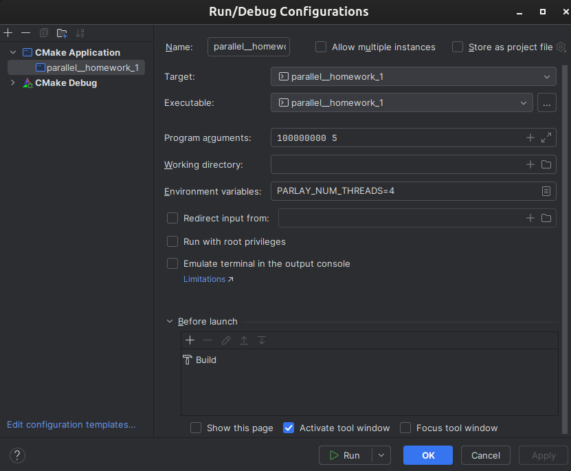

# Parallel quicksort
Представлено 3 версии quicksort в quicksort.h:
1) seq
2) parallel линейным спаном
3) paralell с логарифмическим спаном.

Причём parallel с логарифмическим спаном при batch_size <= 100000005, будет вызывать parallel с линейным спаном

Ниже прикладываю запуск с полученным 3x улучшением. Параметры запуска

Результат вывода
```
/home/alexey/CLionProjects/parallel--homework-1/cmake-build-debug/parallel__homework_1 100000000 5
test_passed, quicksort seq: 42.6133
test_passed, quicksort seq: 42.0455
test_passed, quicksort seq: 42.3019
test_passed, quicksort seq: 42.556
test_passed, quicksort seq: 43.113
mean time: 42.5259
test_passed, quicksort par line: 13.3024
test_passed, quicksort par line: 13.0894
test_passed, quicksort par line: 13.322
test_passed, quicksort par line: 13.461
test_passed, quicksort par line: 13.0455
mean time: 13.2441
test_passed, quicksort par log: 13.2783
test_passed, quicksort par log: 13.6827
test_passed, quicksort par log: 13.1746
test_passed, quicksort par log: 13.4648
test_passed, quicksort par log: 12.8748
mean time: 13.295
```